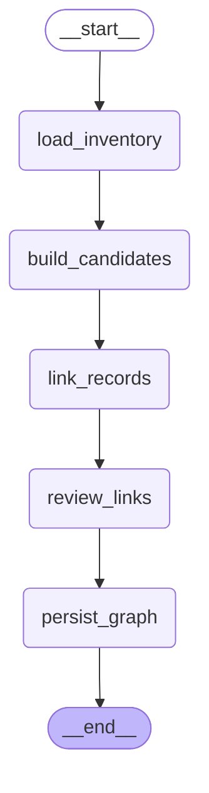

# Context Graph Agent

The context graph agent runs after curated records are available. It builds a
sparse graph of useful relationships between decisions, constraints, facts,
preferences, references, evidence, and handoffs.

The graph below is generated from the compiled LangGraph runtime shape.

## Inputs

- active durable records for one project
- semantic-neighbor candidate pairs
- existing graph edges for duplicate avoidance

## Flow

1. `load_inventory` loads active durable records and existing graph edges.
2. `build_candidates` builds mutual semantic-neighbor clusters and candidate
   record pairs.
3. `link_records` asks BAML to propose sparse, grounded relationships.
4. `review_links` asks BAML to drop weak, duplicate, or generic links.
5. `persist_graph` writes graph nodes, graph edges, and semantic cluster labels.

## Clustering

The persisted graph stores one durable cluster layer:

- semantic clusters from mutual semantic-neighbor records

The dashboard can derive Louvain communities and combined visual lenses from
accepted graph links without adding transient visualization labels to the local
runtime store.

## Output

The graph projection is derived context. Durable records stay canonical.
`context_nodes` and `context_edges` are refreshed from curated records and then
shipped to the dashboard for clustered graph exploration.
