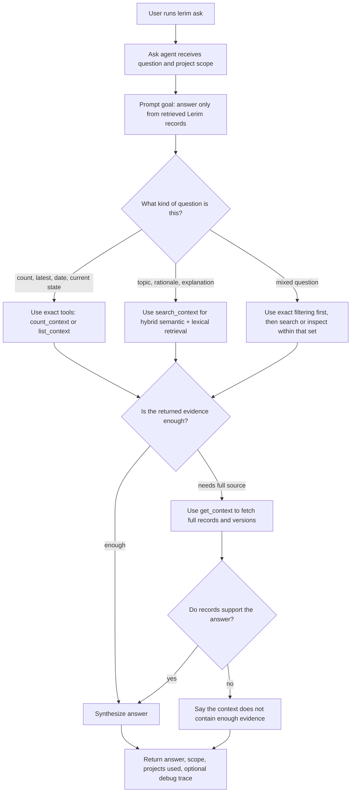

# lerim ask

Query existing project context.

## Examples

```bash
lerim ask "What decisions do we have about auth?"
lerim ask "How is caching handled?" --scope project --project lerim-cli
```

## How it works

`ask` uses hybrid retrieval against the global context database and then fetches the full records needed for the answer.



Use `--scope project` when you want one project only.
