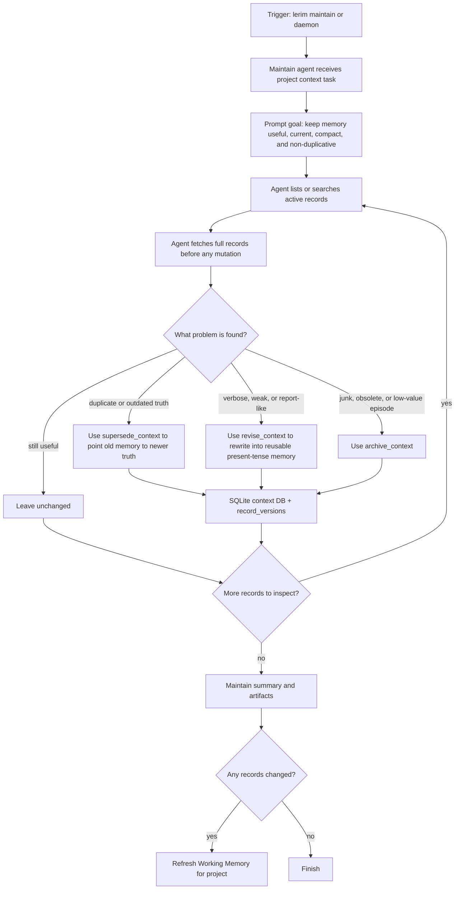

# lerim maintain

Run one context-maintenance pass.

## Examples

```bash
lerim maintain
lerim maintain --dry-run
```

## What it does

`maintain` reads existing records and improves the graph:

- merge duplicates
- archive low-value records
- link related records
- supersede outdated records

It works on the database.

## Flow


