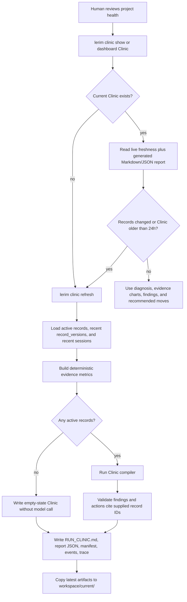

# Run Clinic

Run Clinic is Lerim's project diagnostic layer. It turns persisted context
records and recent project activity into a human-facing report: recurring
friction, context gaps, verification gaps, strengths, and recommended
improvements.

It is deliberately separate from the two memory artifacts:

- Context Brief: long-term startup context for agents.
- Working Memory: short-term continuation context for agents.
- Run Clinic: project-level diagnosis for humans deciding what to improve.

The current artifacts live at:

```text
~/.lerim/workspace/current/<project_id>/RUN_CLINIC.md
~/.lerim/workspace/current/<project_id>/RUN_CLINIC.report.json
```

## Flow



## What It Diagnoses

The compiler receives structured context evidence and deterministic metrics. It
does not keyword-match user wording. Useful Clinic output includes:

- recurring failure modes or verification gaps
- missing eval assets or weak feedback loops
- context records that should become skills, procedures, or project rules
- workflow friction that should be made visible in the dashboard
- strengths worth preserving because they reduce repeated agent steering

Each finding and recommended action must cite exact context record IDs. If
evidence is sparse, Clinic should say so instead of pretending to know more than
the context store supports.

## Dashboard Shape

The dashboard Clinic page is intentionally visual-first:

- readiness score for whether the evidence base is useful
- evidence mix across records, versions, and sessions
- friction map grouped by operational role stage
- change pulse over the trend window
- evidence-backed diagnosis cards
- recommended move cards
- Markdown artifact and version history

The JSON report powers charts and cards; the Markdown artifact remains useful
for CLI review and archival reading.

## Refresh Rules

Clinic refresh is offline. It is not part of the ingest hot path.

- `lerim clinic show`, `status`, and `path` are fast local reads.
- `lerim clinic refresh` generates only when records changed or the artifact is
  older than 24 hours, unless `--force` is passed.
- the daemon daily pass refreshes Clinic for registered projects and skips fresh
  projects.
- curation triggers Clinic when records were created, updated, or archived.
