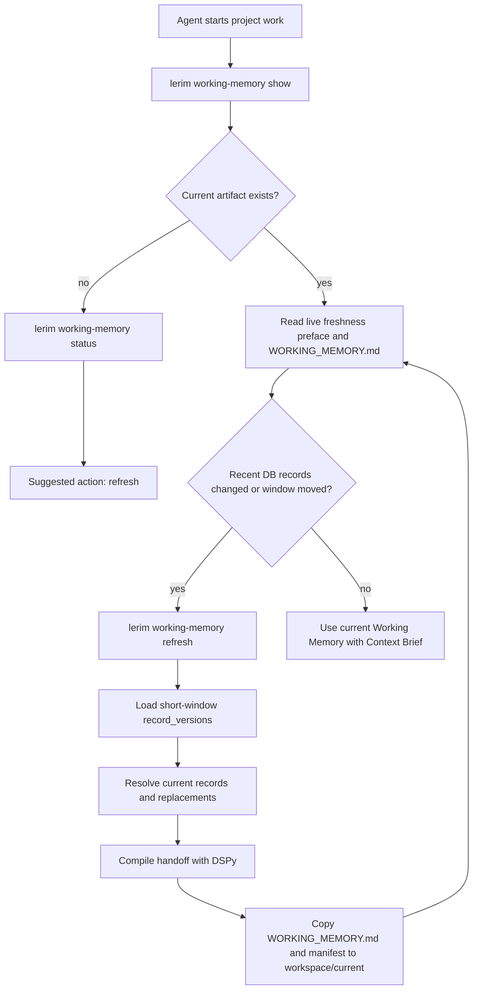

# Working Memory

Working Memory is Lerim's short-term continuation handoff. It is a generated
Markdown view of recent `record_versions`, not a second durable store.

Use it beside Context Brief:

- Context Brief: durable long-term decisions, preferences, constraints, and
  facts.
- Working Memory: a short-term handoff compiled from the latest context changes,
  with where to resume only if the next user prompt continues the same work.

Working Memory is not a task list. The next user prompt decides the next task.

The current view lives at:

```text
~/.lerim/workspace/current/<project_id>/WORKING_MEMORY.md
```

## Flow



## Generation

Working Memory uses a DSPy compile step, like Context Brief, but over a shorter
input horizon. The deterministic part loads recent `record_versions`, fetches
the current record for each changed record, follows `superseded_by_record_id`
when needed, and validates that every generated line cites supplied records.

The default recency window is two hours. A current Working Memory artifact
becomes stale when:

- the stable current file is missing
- the manifest is missing
- cited records disappeared from the live DB
- project records changed after the artifact was generated
- the two-hour short-term window has moved past the artifact age

## Sections

The Markdown artifact uses stable sections:

1. `Summary`
2. `Start Here`
3. `Recent Changes`
4. `Current Context`
5. `Recently Replaced / Archived`
6. `Open Questions`
7. `Workspace Snapshot`
8. `Sources`

The important invariant is current truth. Superseded and archived records may
appear in `Recent Changes` or `Recently Replaced / Archived`, but `Current
Context` uses active records or their replacements. `Start Here` must stay
evidence-backed and must not invent generic next actions.

## Commands

```bash
lerim working-memory show
lerim working-memory status
lerim working-memory path
lerim working-memory refresh
lerim working-memory refresh --force
```

`show`, `status`, and `path` are fast local reads. `refresh` writes a dated run
folder under:

```text
~/.lerim/workspace/YYYY/MM/DD/working-memory/working-memory-<timestamp>-<id>/
```

The latest successful run is copied to:

```text
~/.lerim/workspace/current/<project_id>/
  WORKING_MEMORY.md
  WORKING_MEMORY.manifest.json
```
