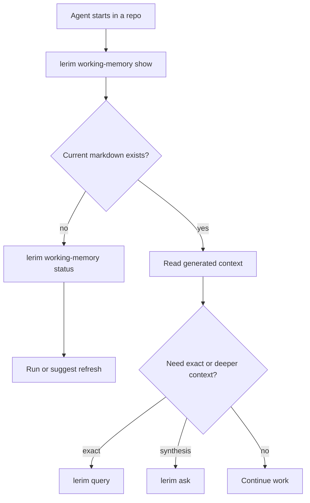

# Lerim

Use this skill when you need project context before or during coding work.

Lerim stores durable context from past agent sessions and exposes it through a small CLI/API surface. The important distinction is:

- `lerim working-memory show` for instant precomputed startup context
- `lerim query` for exact deterministic retrieval
- `lerim ask` for retrieval plus synthesis
- `lerim status` for runtime health, project counts, and queue state

## Resolve the command

Before running Lerim, resolve the command. Some Codex or automation shells have the package available through `uvx` but do not have a plain `lerim` shim on `PATH`.

```bash
if command -v lerim >/dev/null 2>&1; then
  LERIM=(lerim)
elif command -v uvx >/dev/null 2>&1; then
  LERIM=(uvx lerim)
elif [ -x /Users/kargarisaac/.local/bin/uvx ]; then
  LERIM=(/Users/kargarisaac/.local/bin/uvx lerim)
else
  echo "Lerim is not runnable from this shell; install a command shim with: uv tool install lerim"
fi
```

Do not treat `lerim: command not found` as Lerim being unavailable until the `uvx lerim` fallback has been tried. In examples below, replace `lerim` with the resolved command.

## When to use

- Before starting a task in a repo with existing Lerim history
- When a decision, constraint, or preference may already have precedent
- When debugging and you want prior facts or earlier decisions
- When you need current vs historical truth from stored records

## Fast path

Start with the smallest tool that answers the question:

1. Use `lerim working-memory show` at startup for fast project context.
2. Use `lerim query` for counts, latest rows, date windows, and exact inspection.
3. Use `lerim ask` when you need a synthesized explanation or semantic retrieval.
4. Use `lerim status` or `lerim queue` when the question is operational rather than semantic.

Examples:

```bash
"${LERIM[@]}" working-memory show
"${LERIM[@]}" working-memory status
"${LERIM[@]}" query records count --kind decision
"${LERIM[@]}" query records list --kind constraint --limit 10
"${LERIM[@]}" ask "What do we already know about the auth flow?"
"${LERIM[@]}" ask "What changed recently about storage and why?"
"${LERIM[@]}" status --json
```

## Working Memory flow

Working Memory is the startup path. It is generated ahead of time by the daemon
or by `lerim working-memory refresh`, so `show`, `status`, and `path` should be
fast local reads. `show` prepends live DB freshness before printing the static
markdown snapshot.



## Working rules

- Working Memory is a generated markdown view of SQLite records, not durable state.
- Read the live freshness block. If it reports changed DB records and newest context matters, suggest `lerim working-memory refresh`.
- Use `lerim working-memory status` to see dynamic age, DB record-change count, current path, latest run, and suggested action.
- Use `lerim working-memory path` when another tool needs the stable Markdown path.
- Do not hardcode project IDs. Run commands from inside the repo or pass `--project <name-or-path>`.
- Treat test/build results inside Working Memory as historical persisted evidence; rerun relevant checks after edits.
- Expect a fixed section order: Summary, Start Here, Current Handoff, Decisions, Constraints & Preferences, Project Facts, Open Risks / Review Queue, Follow-up Queries, Sources.
- Treat Start Here as deterministic Lerim guidance, not model synthesis.
- Trust Current Handoff only when it cites recent episode evidence; otherwise use the current chat, git state, and tests for live implementation status.
- Prefer `query` over `ask` when the question is exact.
- Prefer `ask` over manual browsing when the question needs synthesis across records.
- Treat Lerim as the context layer, not as a place to manually edit durable state during normal coding work.
- Query Lerim through its CLI/API instead of inspecting storage directly.
- If the runtime is down, say so plainly and use the repo/codebase directly rather than pretending Lerim answered.

## Operational notes

- `lerim up` runs the local service in Docker.
- `lerim serve` runs the local API directly without Docker.
- `lerim dashboard` is only a transition message; the hosted UI lives on Lerim Cloud.
- Local durable context is stored in the global SQLite store.

## Read more when needed

Open [cli-reference.md](cli-reference.md) only when you need:

- full command syntax
- runtime vs host-only command behavior
- less common commands like `queue`, `retry`, `skip`, `skill`, or `auth`
